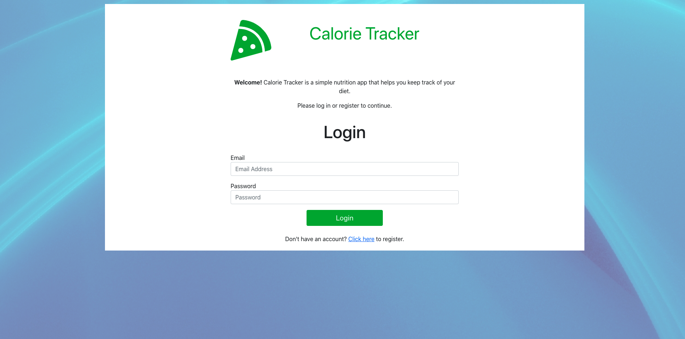
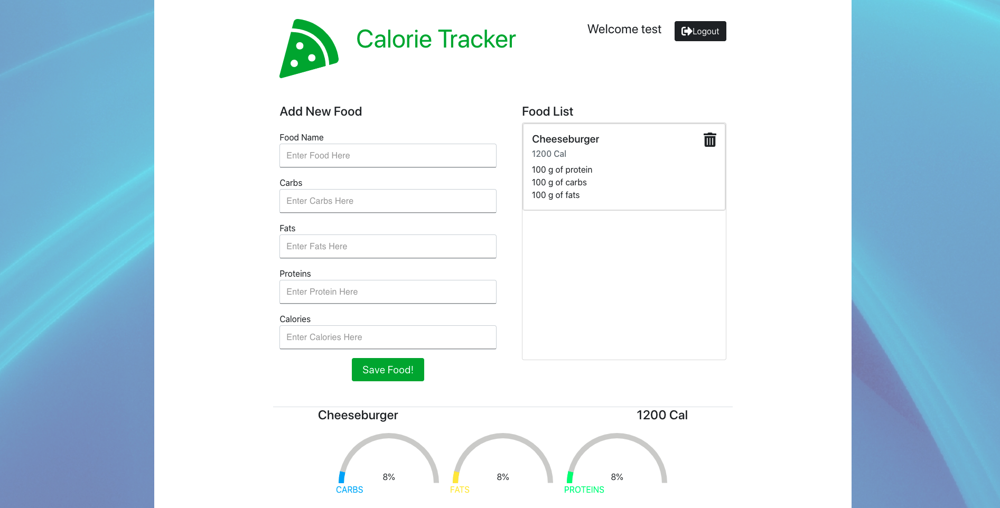

# Cal - Tracker

A web based calorie tracker to help log and track their nutrition intake on a day-to-day basis. 

## Technologies used 
Frontend---
Font Awesome
Material UI
Axios
Bootstrap
react-alert
react-bootstrap
rxjs
react
react-dom
validator
Backend---
bcrypt
jsonwebtoken
express
dotenv
mongoose    

## Contributors

* Asli Farah- Frontend
* Betiel Habte- Backend

## Screenshots of the application

## Submission 

* The URL to the deployed application: https://fierce-beyond-40641.herokuapp.com

* The URL to the GitHub repository: https://github.com/betielbetu/Google-Books-Search